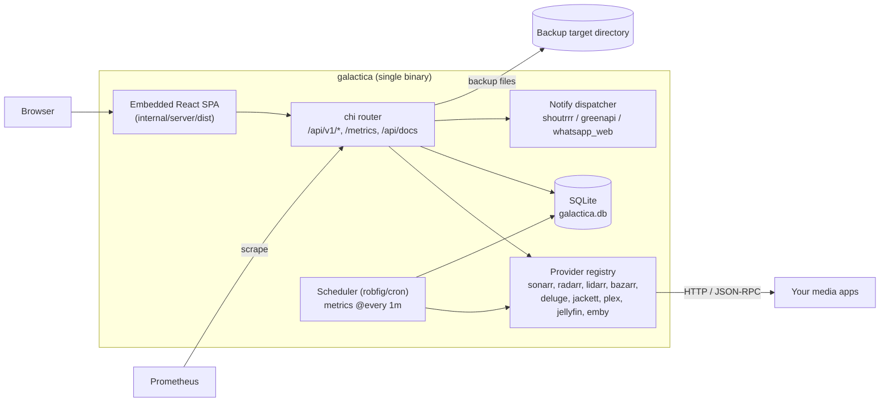

# Galactica (managarr)

Galactica is a self-hosted "mission control" for a home media stack. It is a single Go binary with an embedded React web UI. You register your Sonarr, Radarr, Lidarr, Bazarr, Deluge, Jackett, Plex, Jellyfin and Emby instances in it. Galactica then polls them for live stats, exports their metrics to Prometheus, backs up their configuration to disk, compares configuration between instances of the same app, and stores notification channels. Everything is kept in one SQLite database.

It is aimed at people who run a *arr-style stack and want one dashboard and one backup and metrics point for all of it, instead of opening every app separately.

> **About the name:** the GitHub repository is called **managarr**, but inside the code the product is **Galactica**. The Go module is `github.com/t0mer/galactica`, the binary is `galactica` (`cmd/galactica`), environment variables use the `GALACTICA_` prefix, the database file is `galactica.db`, and the UI and API docs are titled "Galactica". This README uses "Galactica" for the application and "managarr" only for the repository.

> **Project status:** early development. There are no tagged releases, published binaries or container images yet (see [Installation](#installation)). Several features are only partly wired up. They are called out in the sections below, so read [Known limitations](#known-limitations) before you rely on it. **`make build` currently fails at HEAD**: `npm ci` rejects `web/package-lock.json` because it is out of sync (for example, `@emnapi/core@1.11.3` is missing), and after a fresh install `tsc -b` fails with TS2741 because `KIND_COLORS` in `web/src/pages/Apps.tsx` has no `bazarr` entry.

<!-- TODO: screenshot -->

## Table of contents

- [Features](#features)
- [Supported services](#supported-services)
- [Architecture](#architecture)
- [Requirements](#requirements)
- [Installation](#installation)
- [Configuration](#configuration)
- [Using the web UI](#using-the-web-ui)
- [API reference](#api-reference)
- [Prometheus metrics](#prometheus-metrics)
- [Notifications](#notifications)
- [Backups](#backups)
- [Configuration sync](#configuration-sync)
- [Background scheduler](#background-scheduler)
- [Security notes](#security-notes)
- [Known limitations](#known-limitations)
- [Troubleshooting](#troubleshooting)
- [Development](#development)
- [Contributing](#contributing)
- [License](#license)

## Features

- **One inventory for the whole stack.** Add, edit, enable or disable, delete and connection-test instances of nine supported apps from the UI or the REST API.
- **Live dashboard.** Per-instance cards for Sonarr, Radarr, Lidarr, Jackett, Deluge and Plex. Most cards refresh every 60 seconds, the Deluge card every 30 seconds, and the Jackett card (which re-tests indexers) every 5 minutes. They show series, movie, artist and album counts, queue and missing counts, Deluge transfer rates and torrent states, Jackett indexer health, and Plex libraries and active streams.
- **Jackett indexer monitoring.** Galactica lists the configured indexers, probes each monitored indexer in parallel, and lets you switch monitoring on or off for each indexer.
- **Prometheus exporter.** A `/metrics` endpoint publishes every value the scheduler collects, as `galactica_instance_metric{instance_id, instance_name, kind, metric}`.
- **Built-in time series.** Every collected sample is also stored in SQLite and can be queried through `/api/v1/metrics/series`.
- **Configuration backups.** Galactica triggers and downloads native backup archives from Sonarr, Radarr, Lidarr and Bazarr, and exports the configuration of Deluge and Jackett. Files are written to local backup targets.
- **Config comparison ("sync").** Galactica diffs quality profiles and naming settings between two instances of the same app (see the [limitations](#configuration-sync)).
- **Notification channels.** You can configure channels for Shoutrrr (Slack, Discord, Telegram, Gotify, SMTP, ntfy and more), Green-API (WhatsApp) and a self-hosted WhatsApp Web gateway, and send a real test message before you save.
- **Secrets encrypted at rest.** API keys, usernames, passwords and notification credentials are encrypted with AES-256-GCM when a `secret_key` is configured.
- **Swagger UI.** The API docs at `/api/docs` are served from embedded assets, so no CDN calls are made.
- **Operational endpoints.** `/api/v1/health`, `/version` and `/readyz`.
- **Runs as an OS service.** `--service install|uninstall|start|stop|restart` uses [kardianos/service](https://github.com/kardianos/service).
- **Light and dark theme.** The navbar has a toggle, and the choice is remembered in the browser.
- **No CGO.** The binary is pure Go and uses the `modernc.org/sqlite` driver.

## Supported services

Each instance has a **kind**, a **name**, a **base URL** and up to three credentials. The credentials are an "API key", a username and a password. The "API key" field means something different for each app:

| Kind (`kind`) | What goes in `api_key` | Username / password | Connection test | Metrics collected every minute | Dashboard card | Backup (export) | Sync (diff) |
|---|---|---|---|---|---|---|---|
| `sonarr` | Sonarr API key (`X-Api-Key`) | Optional. Used for Forms/Basic auth to download the backup ZIP | `GET /api/v3/system/status` | `sonarr_series_total`, `sonarr_queue_total`, `sonarr_missing_episodes` | Series, In Queue, Missing Episodes | Native backup ZIP (JSON export fallback) | Quality profiles, naming |
| `radarr` | Radarr API key | Optional, same as Sonarr | `GET /api/v3/system/status` | `radarr_movies_total`, `radarr_queue_total`, `radarr_missing_movies` | Movies, On Disk, Missing, In Queue | Native backup ZIP (JSON export fallback) | Quality profiles, naming |
| `lidarr` | Lidarr API key | Optional, same as Sonarr | `GET /api/v1/system/status` | `lidarr_artists_total`, `lidarr_queue_total` | Artists, Albums, In Queue, Missing | Native backup ZIP (JSON export fallback) | Quality profiles |
| `bazarr` | Bazarr API key (`X-API-KEY`) | Not used | `GET /api/system/status` | `bazarr_wanted_episodes`, `bazarr_wanted_movies`, `bazarr_providers_total`, `bazarr_subtitles_downloaded`, `bazarr_subtitles_failed` | None | Native backup ZIP | No |
| `deluge` | **Deluge Web UI password** (JSON-RPC `auth.login`) | Not used | `auth.login` + `core.get_session_status` | `deluge_download_rate_bytes`, `deluge_upload_rate_bytes`, `deluge_num_connections` | Rates, connections, torrent counts by state | `core.get_config` as JSON | No |
| `jackett` | Jackett API key (Torznab `apikey`) | Not used | Torznab `?t=caps` | `jackett_indexers_total`, `jackett_indexers_configured` | Configured indexers, test status, monitor toggle | Torznab indexer list (XML) | Configured indexer count |
| `plex` | Plex token (`X-Plex-Token`) | Not used | `GET /` | `plex_active_sessions`, `plex_library_sections` | Server name, active streams, movie/show library counts | No | No |
| `jellyfin` | Jellyfin API key (`X-Emby-Token`) | Not used | `GET /System/Info` | `jellyfin_active_sessions`, `jellyfin_library_folders` | None | No | No |
| `emby` | Emby API key (`X-Emby-Token`) | Not used | `GET /System/Info` | `emby_active_sessions`, `emby_library_folders` | None | No | No |

Notes:

- The base URL is the address Galactica uses to reach the app, for example `http://192.168.1.10:8989`. For Bazarr, Galactica adds `/api` itself. For Deluge it calls `<base_url>/json`.
- **Bazarr can only be added through the API for now.** The kind drop-down in the UI lists the other eight apps. `POST /api/v1/instances` with `"kind": "bazarr"` works.
- The UI shows the username and password fields for Sonarr, Radarr and Lidarr only.

## Architecture



- `cmd/galactica/main.go` parses flags, loads the configuration and starts the process through kardianos/service. The process opens storage, starts the scheduler and serves HTTP.
- Each provider in `internal/providers/...` registers itself at start-up. A provider implements some or all of these capabilities: connection test, metric collection, config export (backup) and snapshot/diff (sync).
- Instances, notification channels, backup targets and records, sync jobs and metric samples are stored in SQLite. The schema is created by embedded migrations when the process starts.

## Requirements

- **To run:** any platform supported by `modernc.org/sqlite`. The build uses `CGO_ENABLED=0`, and the database is embedded pure-Go SQLite.
- **Network access** from Galactica to every app you add.
- **To build from source:**
  - Go **1.25.11** or newer (the `go` directive in `go.mod`)
  - Node.js and npm, to build the web UI and to copy the Swagger UI assets. Vite 8 needs Node.js 20.19+ or 22.12+.
  - `make`
  - Optional: [air](https://github.com/air-verse/air) for live reload and [golangci-lint](https://golangci-lint.run/) for `make lint`

## Installation

### Pre-built binaries and container images

**None are published yet.** The repository has no tags and no GitHub releases, and no `techblog/galactica` or `techblog/managarr` image exists on Docker Hub. It also has no GitHub Actions workflows, and `.goreleaser.yaml` is a stub whose build is skipped. For now, releases are built by hand with `make build` (see below).

### Build from source

> **The build is currently broken at HEAD.** `npm ci` fails on the out-of-sync `web/package-lock.json`, and the `--silent` flag in the Makefile hides the reason. After a plain `npm install`, `tsc -b` still fails with TS2741 because `KIND_COLORS` in `web/src/pages/Apps.tsx` has no `bazarr` key. Until both are fixed, the steps below do not produce a working binary. They describe the intended build.

```bash
git clone https://github.com/t0mer/managarr.git
cd managarr
make build VERSION=0.1.0          # intended: builds the UI, copies the Swagger UI assets, then the Go binary
./bin/galactica --version
```

`make build` runs `make ui-build`, which does `npm ci --silent && npm run build` in `web/`. Vite writes the output to `internal/server/dist/`. The target also copies `swagger-ui-bundle.js`, `swagger-ui.css` and `swagger-ui.css.map` into `internal/api/swagger-ui/`. After that, the target runs:

```bash
CGO_ENABLED=0 go build -trimpath -ldflags "-s -w -X .../version.Version=$(VERSION) ..." -o bin/galactica ./cmd/galactica
```

A plain `go build ./cmd/galactica` also compiles, because tracked `.gitkeep` placeholders keep the `go:embed` directives valid. However, that binary has **no web UI**: `/` serves a directory listing that contains only `.gitkeep`. Its Swagger UI is also empty.

Run the binary. The default database path is `/data/galactica.db`, so change it when you run outside a container:

```bash
cp config/config.example.yaml config/config.yaml   # then set secret_key
mkdir -p ./data
GALACTICA_STORAGE_DSN="file:./data/galactica.db?cache=shared&_fk=1" \
  ./bin/galactica --log-format text --config ./config/config.yaml
```

Then open `http://localhost:8080`.

### Docker / Docker Compose

`docker-compose.yml` defines a `galactica` service. The service builds from the repository root, is tagged `techblog/galactica:dev`, publishes port 8080, and keeps `/data` in the named volume `galactica-data`:

```yaml
services:
  galactica:
    image: techblog/galactica:dev
    build:
      context: .
    ports:
      - "8080:8080"
    volumes:
      - galactica-data:/data
    environment:
      GALACTICA_LOG_LEVEL: info
      GALACTICA_LOG_FORMAT: json
      GALACTICA_STORAGE_DSN: "file:/data/galactica.db?cache=shared&_fk=1"
    restart: unless-stopped

volumes:
  galactica-data:
```

> **The repository does not contain a `Dockerfile` yet.** As a result, `docker compose up --build` and `make docker` fail, and the `techblog/galactica:dev` image is not published.

When a Dockerfile exists, add two things to the Compose file:

- a `GALACTICA_SECRET_KEY` together with a config file (see the [secret_key caveat](#environment-variables))
- a volume for your backup target directory

### Run as an OS service

```bash
sudo ./bin/galactica --service install
sudo ./bin/galactica --service start
```

The service is registered under the name `galactica` with the display name "Galactica". **No command-line arguments are stored with the service**, so the installed service starts with the built-in defaults. For example, it uses the database at `/data/galactica.db`. The only way to configure the service is through environment variables set in the service manager, such as a systemd drop-in. Because of the [secret_key caveat](#environment-variables), `GALACTICA_SECRET_KEY` has no effect without `--config`, so **an installed service always stores secrets in plaintext**.

## Configuration

Galactica reads its settings from flags, `GALACTICA_*` environment variables and an optional YAML file.

**Precedence:** command-line flag > environment variable > YAML file > built-in default.

The settings that change at runtime are managed in the UI or the API and stored in the database. These are instances, notification channels, backup targets and sync jobs.

### Options

| YAML key | Environment variable | Flag | Default | Description |
|---|---|---|---|---|
| — | — | `--config` | *(none)* | Path to the YAML config file. No file is read unless you pass this flag. |
| `server.listen` | `GALACTICA_SERVER_LISTEN` | `--listen` | `:8080` | HTTP listen address |
| `storage.driver` | `GALACTICA_STORAGE_DRIVER` | — | `sqlite` | Storage driver. Only `sqlite` is supported. Any other value, including `postgres` (listed in a comment in `config.example.yaml`), fails at start-up. |
| `storage.dsn` | `GALACTICA_STORAGE_DSN` | — | `file:/data/galactica.db?cache=shared&_fk=1` | SQLite DSN or file path |
| `secret_key` | `GALACTICA_SECRET_KEY` (see caveat) | — | *(empty)* | Passphrase for AES-256-GCM encryption of stored secrets. The AES key is the SHA-256 of this value. Generate one with `openssl rand -hex 32`. |
| `log.level` | `GALACTICA_LOG_LEVEL` | `--log-level` | `info` | `debug`, `info`, `warn` (or `warning`), or `error` |
| `log.format` | `GALACTICA_LOG_FORMAT` | `--log-format` | `json` | `json` or `text`. Logs go to stderr. |
| `auth.enabled` | `GALACTICA_AUTH_ENABLED` | — | `false` | Parsed, but **not enforced**. Galactica has no authentication yet (see [Security notes](#security-notes)). |
| — | — | `--service` | *(none)* | `install`, `uninstall`, `start`, `stop` or `restart` |
| — | — | `--version` | — | Prints `Galactica <version> (commit <sha>, built <date>)` and exits |
| — | — | `--help` | — | Prints usage |

### Environment variables

Viper builds the variable names from the YAML keys: it upper-cases them, replaces `.` with `_` and adds the `GALACTICA_` prefix.

> **`GALACTICA_SECRET_KEY` caveat:** `secret_key` has no built-in default. Because of that, the environment variable is picked up **only when the YAML file you pass with `--config` contains a `secret_key:` line**. An empty value such as `secret_key: ""` is enough, and `config/config.example.yaml` already has one. If you run without `--config`, `GALACTICA_SECRET_KEY` is silently ignored and secrets are stored in plaintext. All other variables in the table work without a config file.

### Example config file

`config/config.example.yaml`, verbatim:

```yaml
# config/config.example.yaml
server:
  listen: ":8080"

storage:
  driver: sqlite   # sqlite | postgres
  dsn: "file:/data/galactica.db?cache=shared&_fk=1"

# secret_key is required when any secrets are stored (API keys, tokens).
# Generate with: openssl rand -hex 32
secret_key: ""

log:
  level: info     # debug | info | warn | error
  format: json    # json | text

auth:
  enabled: false
```

Note that `postgres` is not implemented yet, and `auth.enabled` is not enforced.

Set a `secret_key` **before** you add any instances, and do not change it afterwards. Values encrypted under one key cannot be read with a different key.

## Using the web UI

The SPA is served at `/`. It has a sidebar with five pages and a light/dark toggle in the top bar.

| Page | Path | What it does |
|---|---|---|
| **Dashboard** | `/` | Cards for total instances, enabled instances and database status. Per-app sections for Sonarr, Radarr, Lidarr, Jackett, Deluge and Plex. A "Queue Size" chart and an instance table. Most data refreshes every 60 seconds. The Deluge cards refresh every 30 seconds and the Jackett cards every 5 minutes. |
| **Apps** | `/apps` | Add, edit and delete instances, with kind, name, base URL, API key, and username/password for the *arr apps. Test a connection, and enable or disable an instance. Jackett instances also have an indexer view with the probe status and a monitor toggle for each indexer. |
| **Backup** | `/backup` | Create and delete local backup targets (name, path, retention days, enabled). Run a backup of an instance to a target, and list the last 50 backups of a target. |
| **Sync** | `/sync` | Create sync jobs between two instances of the same kind, with an optional cron schedule. Preview the differences, and "Apply" them (see [limitations](#configuration-sync)). |
| **Settings** | `/settings` | Manage notification channels: add, edit, enable or disable, delete, and send a test. |

Typical first run:

1. Open **Apps** and add each instance with its base URL and API key. Then click **Test**.
2. Wait a minute for the scheduler to collect the first samples, then open **Dashboard**.
3. In **Backup**, add a target directory that the Galactica process can write to, and run a backup for each app.
4. In **Settings**, add a notification channel and send a test message.

<!-- TODO: screenshot -->

## API reference

- The Swagger UI is at **`/api/docs`**, and the raw spec is at `/api/docs/openapi.yaml`.
- The embedded `internal/api/openapi.yaml` is still the Phase-1 spec. It describes only the health, version and readiness endpoints. It also places `/version` and `/readyz` under the `/api/v1` server, but the router serves them at the root. The tables below were checked against `internal/server/server.go` and are the full list.
- **Auth:** none. Every endpoint is open (see [Security notes](#security-notes)).
- Errors are returned as `{"error": "<message>"}`.

### Operational endpoints

| Method | Path | Description |
|---|---|---|
| GET | `/api/v1/health` | `{"status":"ok","version":"…","db":"ok"}`. `db` is `"error"` when the ping fails. |
| GET | `/version` | `{"version":"…","commit":"…","date":"…"}` |
| GET | `/readyz` | `200` when the DB answers a ping, otherwise `503` |
| GET | `/metrics` | Prometheus exposition format |
| GET | `/api/docs` | Swagger UI |

### Instances

| Method | Path | Body / query | Response |
|---|---|---|---|
| GET | `/api/v1/instances` | — | Array of instances |
| POST | `/api/v1/instances` | `{"kind","name","base_url","api_key"?,"username"?,"password"?}`. `kind`, `name` and `base_url` are required. | `201` + instance |
| GET | `/api/v1/instances/{id}` | — | Instance |
| PUT | `/api/v1/instances/{id}` | `{"name","base_url","api_key"?,"username"?,"password"?}`. Empty credentials keep the stored value. | Instance |
| DELETE | `/api/v1/instances/{id}` | — | `204` |
| POST | `/api/v1/instances/{id}/test` | — | `{"ok":true}` or `{"ok":false,"error":"…"}` |
| PATCH | `/api/v1/instances/{id}/enabled` | `{"enabled":true}` | `204` |

An instance is returned as `{"id","kind","name","base_url","enabled","created_at"}`. Credentials are never returned.

```bash
curl -X POST http://localhost:8080/api/v1/instances \
  -H 'Content-Type: application/json' \
  -d '{"kind":"sonarr","name":"Sonarr","base_url":"http://sonarr:8989","api_key":"<your-api-key>"}'
```

### Per-app live stats

These endpoints query the app directly, not the stored samples.

| Method | Path | Response fields |
|---|---|---|
| GET | `/api/v1/instances/{id}/sonarr/stats` | `series_total`, `queue_total`, `missing_episodes` |
| GET | `/api/v1/instances/{id}/radarr/stats` | `movies_total`, `movies_on_disk`, `missing_movies`, `queue_total` |
| GET | `/api/v1/instances/{id}/lidarr/stats` | `artists_total`, `albums_total`, `queue_total`, `missing_albums` |
| GET | `/api/v1/instances/{id}/deluge/stats` | `download_rate`, `upload_rate`, `num_connections`, `torrents{total,downloading,seeding,paused,error}` |
| GET | `/api/v1/instances/{id}/plex/stats` | `server_name`, `active_sessions`, `libraries[{key,title,type,count}]` for movie libraries, or `libraries[{key,title,type,shows,seasons,episodes}]` for show libraries |
| GET | `/api/v1/instances/{id}/jackett/stats` | `indexers[{id,name,configured,monitored,test_status,test_error}]`, `total`, `configured`, `ok`, `error` |
| PATCH | `/api/v1/instances/{id}/jackett/indexers/{indexer_id}` | Body `{"monitored":false}` → `204` |

For Jackett, `test_status` is `ok`, `error` or `skipped`. Unmonitored indexers are skipped, and each probe times out after 8 seconds.

### Stored metrics

| Method | Path | Query | Response |
|---|---|---|---|
| GET | `/api/v1/metrics` | `instance_id` (required) | `{"instance_id","metrics":[names]}` |
| GET | `/api/v1/metrics/series` | `instance_id` and `metric` (both required), `since` (Go duration such as `6h`, default `24h`) | `{"instance_id","metric","points":[{"ts","value"}]}` |

### Notification channels

| Method | Path | Body | Response |
|---|---|---|---|
| GET | `/api/v1/notify/channels` | — | Array of `{"id","name","provider","enabled","notify_on_success","notify_on_failure","created_at"}` |
| POST | `/api/v1/notify/channels` | `{"name","provider","config":{…},"enabled","notify_on_success","notify_on_failure"}` | `201` + channel |
| PUT | `/api/v1/notify/channels/{id}` | Same fields as POST, except that `provider` cannot be changed and is ignored | Channel. **`config` is replaced as a whole.** An update without credentials erases the stored ones. |
| DELETE | `/api/v1/notify/channels/{id}` | — | `204` |
| POST | `/api/v1/notify/channels/test` | `{"provider","config":{…}}` | `{"ok":true}` or `{"ok":false,"error":"…"}` |

### Backup

| Method | Path | Body | Response |
|---|---|---|---|
| GET | `/api/v1/backup/targets` | — | Array of `{"id","name","type","retention_days","enabled","created_at"}` |
| POST | `/api/v1/backup/targets` | `{"name","path","type"?,"retention_days"?,"enabled"}`. `type` defaults to `local` and `retention_days` to `30`. | `201` + target |
| DELETE | `/api/v1/backup/targets/{id}` | — | `204` |
| POST | `/api/v1/backup/run` | `{"target_id","instance_id"}` | `202` `{"backup_id","status":"pending"}` |
| GET | `/api/v1/backup/targets/{id}/backups` | — | Last 50 records: `{"id","target_id","instance_id","ts","size_bytes","status","location"?,"error"?}` |

### Sync

| Method | Path | Body | Response |
|---|---|---|---|
| GET | `/api/v1/sync/jobs` | — | Array of `{"id","source_instance_id","target_instance_id","selectors","schedule"?,"enabled","created_at"}` |
| POST | `/api/v1/sync/jobs` | `{"source_instance_id","target_instance_id","selectors"?,"schedule"?,"enabled"}` | `201` `{"id"}` |
| DELETE | `/api/v1/sync/jobs/{id}` | — | `204` |
| POST | `/api/v1/sync/jobs/{id}/preview` | — | `{"changes":[{"field","old_value","new_value"}],"count"}` |
| POST | `/api/v1/sync/jobs/{id}/apply` | — | `{"applied":N}` or `{"applied":0,"message":"already in sync"}` |

## Prometheus metrics

`/metrics` uses the default Prometheus registry, so it also exposes the standard `go_*` and `process_*` collectors.

| Metric | Type | Labels | Description |
|---|---|---|---|
| `galactica_instance_metric` | gauge | `instance_id`, `instance_name`, `kind`, `metric` | The latest value of each sample collected from an enabled instance. The possible `metric` values are listed in [Supported services](#supported-services). |
| `galactica_log_entries_total` | counter | `instance_id`, `level` | Log lines collected from Sonarr, Radarr, Lidarr and Bazarr by the 5-minute collector |
| `galactica_open_issues` | gauge | `instance_id`, `severity` | Registered, but never set, so it does not appear in the output |

Example scrape config:

```yaml
scrape_configs:
  - job_name: galactica
    static_configs:
      - targets: ["galactica:8080"]
```

Example query for the current Sonarr queue:

```promql
galactica_instance_metric{kind="sonarr", metric="sonarr_queue_total"}
```

## Notifications

Channels are managed on the **Settings** page or at `/api/v1/notify/channels`. The `provider` value picks the transport, and `config` holds the fields for that provider:

| Provider (`provider`) | `config` fields | How it sends |
|---|---|---|
| `shoutrrr` | `url` | [Shoutrrr](https://containrrr.dev/shoutrrr/) URL, for example `slack://…`, `discord://…`, `telegram://…`, `gotify://…`, `smtp://…` or `ntfy://…` |
| `greenapi` ([Green-API](https://green-api.com/), WhatsApp) | `instance_id`, `token`, `phone`, `api_url` (optional, default `https://api.green-api.com`) | `POST {api_url}/waInstance{instance_id}/sendMessage/{token}` with `{"chatId":"{phone}@c.us","message":…}` |
| `whatsapp_web` (self-hosted WhatsApp Web gateway) | `base_url`, `phone`, `username`/`password` (optional Basic auth) | `POST {base_url}/api/send-message` with `{"chatId","message"}` |

For phone numbers, use the international format with digits only (for example `972501234567`). `@c.us` is added unless the value already contains `@`. Galactica trims whitespace from the Green-API instance ID, token and phone.

Every channel also has `enabled`, `notify_on_success` and `notify_on_failure` flags. **Send test** calls `/api/v1/notify/channels/test` with the values currently in the form, so you can check them before you save. The test message is "Galactica test notification".

> **Current state:** nothing sends notifications automatically yet. The test endpoint is the only code that calls the dispatcher. Channel credentials are stored encrypted, and **only when `secret_key` is set**. Without a key, the provider config of a channel is not saved at all.

## Backups

A **backup target** is a local directory (`type: local`). When you run a backup of an instance to a target, the file is written to:

```
<target path>/<instance id>/<file name>
```

Directories are created with mode `0750` and files with mode `0640`. The backup record stores only the relative path. The job runs in the background: the API answers `202`, and the record goes from `pending` to `success` or `error`.

What each app produces:

| App | What is saved |
|---|---|
| Sonarr / Radarr / Lidarr | Galactica runs the app's `Backup` command and waits up to 2 minutes for it. It then downloads the newest native backup **ZIP**, using the name the app gave it. The download is tried with a Forms-auth login, then through the API, then as a web download (Basic auth, no auth, `apiKey`). If all of these fail, for example because only an API key is set and the app requires Forms auth, Galactica writes a **JSON export** instead: `<name>_config_<timestamp>.json`, containing quality profiles, indexers, download clients, custom formats, tags, root folders, naming and media-management config, and the movie, series or artist lists. This export is not a full backup that the app can restore. |
| Bazarr | Galactica triggers `POST /api/system/backups` and downloads the newest **ZIP** |
| Deluge | The result of `core.get_config` as **JSON** (`<name>-<timestamp>.json`) |
| Jackett | The Torznab indexer list as **XML**. The file is currently saved with a `.zip` extension. |
| Plex / Jellyfin / Emby | Not supported. The API returns `400 provider does not support config backup`. |

Limitations: `retention_days` is stored but old files are **not pruned**. There are no scheduled backups, and restore/import is not implemented. When you run Galactica in a container, mount the target directory as a volume.

## Configuration sync

A sync job links a **source** and a **target** instance of the same kind. **Preview** takes a snapshot of both and lists the top-level fields that differ:

- Sonarr and Radarr: `qualityProfiles`, `naming`
- Lidarr: `qualityProfiles`
- Jackett: `indexer_count` (configured indexers)

> **Apply does not change anything yet.** Every provider's `Apply` is a no-op, but the endpoint still returns `{"applied": N}`. The `schedule` (cron) and `selectors` fields are stored, but nothing runs or reads them. Use sync as a read-only drift check for now.

## Background scheduler

`internal/scheduler` uses robfig/cron with two fixed jobs. The intervals cannot be configured.

| Job | Interval | Timeout | What it does |
|---|---|---|---|
| Metrics | `@every 1m` | 55 s | Calls `Collect` on every enabled instance, stores the samples in SQLite and updates `galactica_instance_metric` |
| Logs | `@every 5m` | 4 min | Fetches log lines from the last 6 minutes from providers that expose them (Sonarr, Radarr, Lidarr, Bazarr), stores them and increments `galactica_log_entries_total` |

Stored samples and log lines are never deleted, so the database grows over time.

## Security notes

- **There is no authentication.** Every UI page and every API endpoint is open to anyone who can reach the port. This includes endpoints that write files (backups), make outgoing requests to any URL (connection and notification tests) and return data from your apps. `auth.enabled` has no effect yet. Do not expose Galactica to the internet. Keep it on a trusted LAN or VPN, or put it behind a reverse proxy that handles authentication.
- **Always set `secret_key`**, and set it through a config file (see the [caveat](#environment-variables)). Without it, the API keys and passwords of your apps are stored in **plaintext** in SQLite, and notification channel settings are not saved. Keep the key out of version control, and back up the key and the database together.
- The API keys of Sonarr, Radarr, Lidarr, Bazarr and Jackett, the Plex token and the Deluge password give full control over those apps. Treat `galactica.db` and the backup directories as sensitive. The *arr backup ZIPs contain the app's database and config, including their own API keys.
- Use `http://` base URLs only on networks you trust. Galactica sends credentials in headers, as query parameters (Jackett `apikey`) or in JSON-RPC calls (Deluge).
- `/metrics` is also unauthenticated. It exposes instance names and IDs.

## Known limitations

- There is no authentication or user management. The `admin` and `api_tokens` tables exist, but nothing uses them.
- Only SQLite is supported, even though the example config mentions `postgres`.
- The `_fk=1` parameter in the default DSN is not understood by the `modernc.org/sqlite` driver, so SQLite foreign keys stay off. Deleting an instance does not cascade to its secrets, samples or log rows.
- The scheduler only decrypts the `api_key`, and only when `secret_key` is set. Without a key, background metric collection runs with an empty API key, even though connection tests and live stats work.
- Bazarr, Jellyfin and Emby have no dashboard card. Bazarr is also missing from the UI's kind drop-down.
- The Dashboard "Queue Size" chart requests `/api/v1/metrics/series?metric=queue_size` without an `instance_id`, so it stays empty.
- Editing a notification channel erases its stored credentials. `PUT /api/v1/notify/channels/{id}` overwrites `config`, and the UI edit form leaves the credential fields blank. After every edit, re-enter the credentials.
- Log entries from Sonarr, Radarr, Lidarr and Bazarr are still collected and counted every 5 minutes (`galactica_log_entries_total`). Since the Logs UI and API were removed, they cannot be viewed.
- `make build` fails at HEAD. `npm ci` rejects the out-of-sync `web/package-lock.json` (missing `@emnapi/core@1.11.3`), and `--silent` hides the error. After an install, `tsc -b` fails with TS2741 because `KIND_COLORS` in `web/src/pages/Apps.tsx` lacks `bazarr`.
- Notifications are never sent automatically. Sync apply is a no-op. Backup retention and scheduling are not implemented.
- There is no Dockerfile and no release pipeline yet.

## Troubleshooting

| Symptom | Cause / fix |
|---|---|
| `config error: reading config file …` | The path given to `--config` does not exist or is not valid YAML. |
| `opening storage … unable to open database file` | The directory in the DSN does not exist or cannot be written. The default is `/data/galactica.db`. Set `GALACTICA_STORAGE_DSN` or `storage.dsn` to a writable path. |
| `unsupported storage driver` | `storage.driver` is set to something other than `sqlite`. |
| `/` shows a directory listing with only `.gitkeep` | The binary was built without the web UI (`make ui-build` did not run or failed). |
| `make build` / `make ui-build` fails with no clear message | `npm ci --silent` hides the lockfile mismatch. Run `cd web && npm ci` to see the error. The build is currently broken at HEAD (see [Known limitations](#known-limitations)). |
| `/api/docs` loads but stays blank | The Swagger UI assets were not copied. `make ui-build` must succeed before `go build`. |
| Log warns `GALACTICA_SECRET_KEY not set — storing secret as plaintext` | Set `secret_key` in the YAML file, or set the env var **and** pass a config file that contains `secret_key:`. |
| *arr error `got HTML response (authentication required — add username/password to instance)` | The app requires Forms login for that route. Add a username and password to the instance. |
| An *arr backup is a `.json` file instead of a `.zip` | Every ZIP download strategy failed, so Galactica fell back to the API export. Add the app's username and password to the instance. |
| Deluge test fails with `deluge auth failed` | Put the **Deluge Web UI password** in the API key field. The base URL must point at the Web UI, the one that serves `/json`. |
| Jackett test fails | Use the Jackett API key and the Jackett root URL. Galactica calls `/api/v2.0/indexers/all/results/torznab`. |
| The dashboard has cards but Prometheus has no values | Instances must be enabled. Wait at least 1 minute. Check the `scheduler: collect metrics` warnings in the logs and the `secret_key` limitation above. |

## Development

### Makefile targets

| Target | What it does |
|---|---|
| `make build` | Currently fails at HEAD (see [Known limitations](#known-limitations)). Runs `ui-build`, then `CGO_ENABLED=0 go build -trimpath` with version, commit and date ldflags → `bin/galactica`. Set `VERSION=…` to stamp the version (the default is `dev`). |
| `make ui-build` | `npm ci --silent && npm run build` in `web/` (output in `internal/server/dist/`), then copies `swagger-ui-bundle.js`, `swagger-ui.css` and `swagger-ui.css.map` into `internal/api/swagger-ui/` |
| `make ui-watch` | `npm run dev` (Vite dev server) |
| `make dev` | Runs `air` for live reload of the Go backend |
| `make test` | `go test ./...` |
| `make lint` | `golangci-lint run ./...` (errcheck, gosimple, govet, staticcheck, unused, revive) |
| `make docker` | `docker build -t techblog/galactica:dev .`. This needs a Dockerfile, which does not exist yet. |

### Live reload with air

`.air.toml` rebuilds `./tmp/galactica` when `.go` or `.yaml` files change. It ignores `tmp`, `vendor`, `web/node_modules` and `internal/server/dist`. air starts the binary with no arguments, so export the settings you need first:

```bash
make ui-build          # once, so the embedded UI and Swagger assets exist (currently broken, see Known limitations)
export GALACTICA_STORAGE_DSN="file:./tmp/dev.db?cache=shared&_fk=1" GALACTICA_LOG_FORMAT=text
make dev
```

`vite.config.ts` has no dev-server proxy, so `make ui-watch` does not forward `/api` calls to the Go backend. For end-to-end testing, rebuild the UI with `make ui-build` and use the Go server on port 8080. <!-- TODO: verify intended frontend dev workflow -->

### Project layout

```
cmd/galactica/          entrypoint: flags, config, logging, kardianos service
config/                 config.example.yaml
internal/api/           HTTP handlers, openapi.yaml, embedded Swagger UI
internal/config/        viper/pflag configuration loader
internal/metrics/       Prometheus collectors
internal/notify/        shoutrrr / Green-API / WhatsApp Web dispatcher
internal/providers/     provider interfaces + registry
  bazarr/ deluge/ emby/ jackett/ jellyfin/ plex/
  servarr/              shared *arr client (auth, backup download, API export)
    sonarr/ radarr/ lidarr/
internal/scheduler/     cron jobs (metrics 1m, logs 5m)
internal/server/        chi router, SPA handler, embedded dist/
internal/storage/       SQLite store, migrations, AES-GCM crypto, repositories
internal/version/       build metadata (AppName, Version, Commit, Date)
web/                    React 19 + TypeScript + Vite + Tailwind SPA
```

### Adding a provider

1. Create a package under `internal/providers/<kind>/` that implements `providers.Provider` (`Kind`, `TestConnection`). Optionally also implement `MetricSource`, `LogSource`, `ConfigBackup` or `Syncable`.
2. Call `providers.Register(...)` in `init()`.
3. Add a `Kind` constant in `internal/providers/provider.go`.
4. Add a blank import in `cmd/galactica/main.go`.
5. Add the kind to `ProviderKind` in `web/src/lib/types.ts`, and to both `KINDS` and `KIND_COLORS` in `web/src/pages/Apps.tsx`. A missing `KIND_COLORS` key breaks `tsc -b`.

## Contributing

Issues and pull requests are welcome at [t0mer/managarr](https://github.com/t0mer/managarr). Before you open a PR, run `make test` and `make lint`. Keep each change focused, and use one commit per logical change.

## License

Licensed under the [Apache License 2.0](LICENSE).
